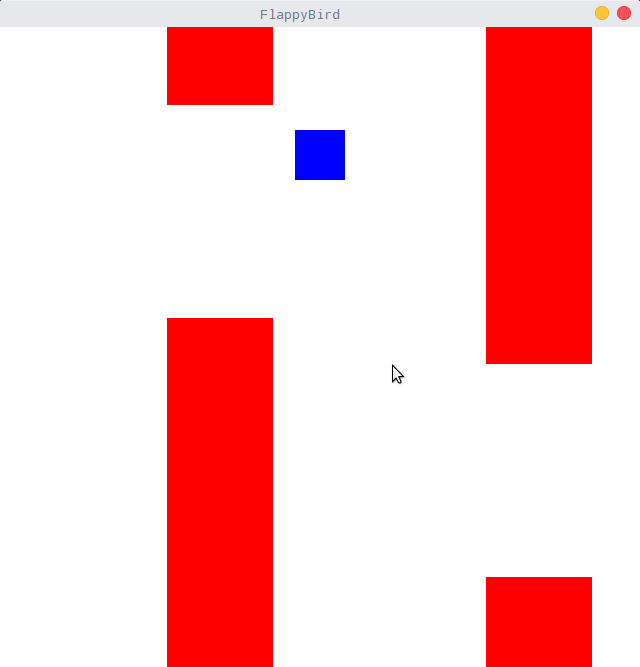
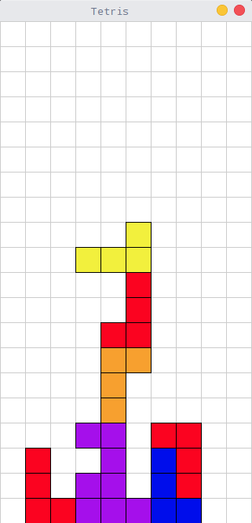

# SDL_Game
A simple  game frame based on SDL2

该项目是基于SDL2图形库开发一个通用的2D游戏框架, 目的是为了在此基础上快速开发一些小游戏.

我实现了 Flappy Bird 和俄罗斯方块两个小游戏的例子, 目前还在不断完善中.

## 如何运行
### 1. 需要安装 SDL2 库
```
sudo apt-get install libsdl2-2.0 libsdl2-dev libsdl2-image-dev libsdl2-ttf-dev
```
### 2. 进入文件夹, 执行 scons 编译代码

## 游戏示例
### 1. FlappyBird

使用鼠标进行操作



### 2. 俄罗斯方块
左右方向键移动, 上键旋转, 下键加速下落


